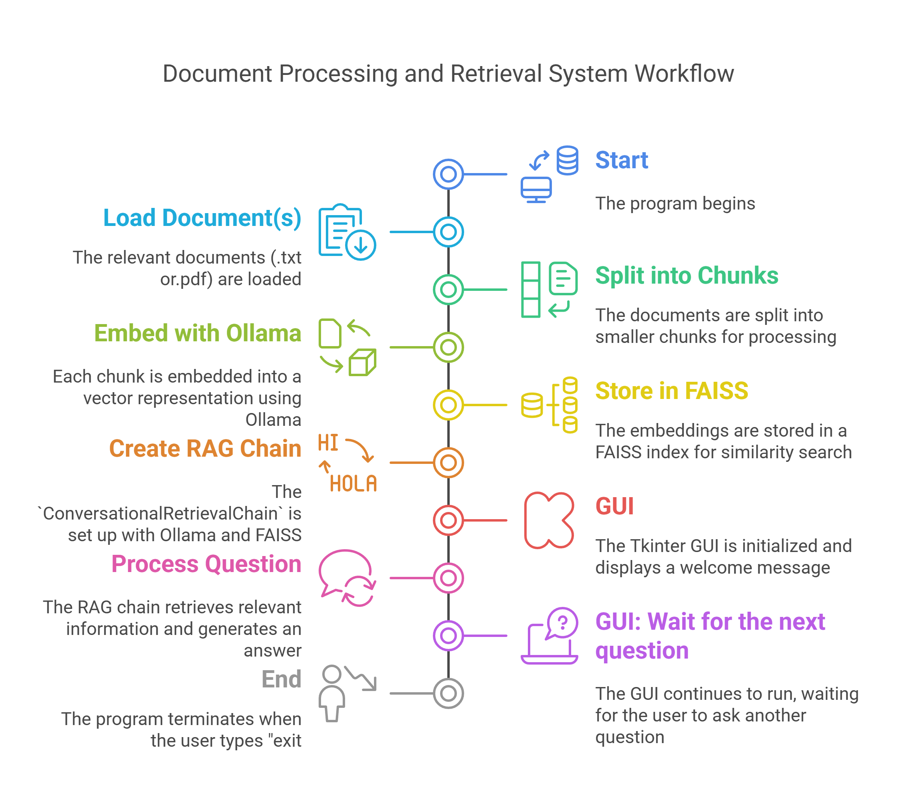

# RAG for Cyber Forensics

[](https://opensource.org/licenses/MIT)

This project demonstrates a simple Retrieval-Augmented Generation (RAG) system for cyber forensics using Ollama and LangChain. It allows you to ask questions about a document related to cyber forensics, and the system will provide answers based on the information in the document.

## Prerequisites

Before running this project, ensure you have the following:

* **Ollama:** Download and install from https://ollama.com/download (approx. 4.5GB fro the Ollama setup and 100 MB for the Ollama server). The models will consume additional disk space depending on the models you download (e.g., the `llama2` model is around 4 GB).
* **Python:** Version 3.7 or higher (approx. 100 MB)
* **pip:** Python package installer
* **Disk space:** Approximately 5-7 GB for the Ollama server, dependencies, and your knowledge base documents, plus additional space for the Ollama models you download.

**Important Note:**

* **Model Location:** Ensure that the downloaded Ollama model is located in the same directory as your code or provide the full path to the model in the `OllamaEmbeddings` and `OllamaLLM` instantiations. This is because the `langchain-ollama` library, by default, looks for the model in the current working directory. If the model is in a different location, you'll need to specify the full path to avoid errors. For example:

  ```python
  embedding = OllamaEmbeddings(model="phi", base_url="http://localhost:11434", model_path="/path/to/your/model")
  llm = OllamaLLM(model="phi", base_url="http://localhost:11434", model_path="/path/to/your/model")

## What is RAG?

Retrieval-Augmented Generation (RAG) is a technique that combines information retrieval with text generation to provide more accurate, factual, and contextually relevant responses. It works by retrieving relevant information from a knowledge base and then using a language model to generate a response based on that information. This allows language models to handle complex questions and access domain-specific knowledge.

## How this project works

This project uses the following components:

* **Ollama:** An open-source large language model (LLM) that can be run locally.
* **LangChain:** A framework for developing applications powered by language models. (approx. 50 MB)
* **FAISS:** A library for efficient similarity search and clustering of vectors. (approx. 20 MB)
* **Tkinter:** A standard Python GUI library used to create the user interface. (included with Python)

The system works as follows:

1.  **Load and split:** The cyber forensics document is loaded and split into smaller chunks.
2.  **Embed:** Each chunk is embedded into a vector representation using Ollama's embedding model.
3.  **Store:** The embeddings are stored in a FAISS index for efficient similarity search.
4.  **Query:** When a user asks a question, the question is embedded and used to search the FAISS index for relevant chunks.
5.  **Answer:** The relevant chunks are passed to Ollama, which generates an answer based on the retrieved information.

## Code Overview

The code is structured as follows:

* **Document loading and processing:** The cyber forensics document is loaded using a custom loader that supports both `.txt` and `.pdf` files. It is then split into chunks using `CharacterTextSplitter` and embedded using `OllamaEmbeddings`.
* **Vectorstore creation:** A FAISS vectorstore is created using the embeddings.
* **Conversational Chain:** A `ConversationalRetrievalChain` is set up to handle multi-turn conversations and maintain context.
* **Tkinter GUI:** A GUI is created using Tkinter, with a text area to display the conversation, an entry field for user input, and a button to send questions. The GUI also includes text formatting for a better user experience.
* **Error handling:** A `try-except` block handles potential errors, such as questions outside the knowledge base, and provides informative messages.

## Why this approach is better

This RAG-based approach offers several advantages over traditional methods:

* **Contextualized responses:** The system provides answers grounded in the provided cyber forensics document, ensuring relevance and accuracy.
* **Interactive interface:** The Tkinter GUI allows for a user-friendly chat-like interaction.
* **Transparency:** The source documents used to generate the answers are displayed, providing traceability and allowing for verification.
* **Efficiency:** FAISS enables fast similarity search for retrieving relevant information, which is crucial for real-time or near real-time applications.
* **Local execution:** Ollama allows for local execution of the language model, enhancing privacy and reducing reliance on external APIs. This is particularly important in cyber forensics investigations where data sensitivity is paramount.
* **Document format support:** The knowledge base supports both `.txt` and `.pdf` files, which are common formats for cyber forensics documentation.

## System Workflow

The following flowchart illustrates the workflow of the RAG system:

## Setup and Usage

1.  **Install Ollama:**

    * Download and install Ollama from the official website: https://ollama.com/download
    * Start the Ollama server: `ollama serve`

2.  **Download an Ollama model:**

    I've used the `phi` model in this code, but you can use any model of your choice. Refer to the official Ollama website (https://ollama.com/search) to find available models.

    To download a model, use the following command:

    ```bash
    ollama pull <model_name>
    ```

    (Replace `<model_name>` with the name of the model you want to use.)

3.  **Install Python dependencies:**

    ```bash
    pip install -r requirements.txt
    ```

4.  **Replace `"D:\\RAG\\sample.txt"` with the path to your cyber forensics document.**

5.  **Update the code to use the chosen model:**

    * In the `OllamaEmbeddings` instantiation: `embedding = OllamaEmbeddings(model="<model_name>")`
    * In the `OllamaLLM` instantiation: `llm=OllamaLLM(model="<model_name>")`

6.  **Run the code:**

    ```bash
    python rag.py
    ```

7.  **Type your questions in the GUI window.**

## Features

* **GUI:** A simple Tkinter-based GUI for interacting with the system.
* **Progress bar:** Shows the progress while the question is being processed.
* **Response time:** Displays the time taken to generate the answer.
* **Source documents:** Shows the source document(s) from which the answer was extracted.
* **Error handling:** Provides informative messages for questions outside the knowledge base.
* **Text formatting:** The GUI uses different colors and fonts to distinguish between questions, answers, and source documents.

## Contributing

Contributions are welcome! Feel free to open issues or pull requests for bug fixes, improvements, or new features.

## License

This project is licensed under the MIT License.
